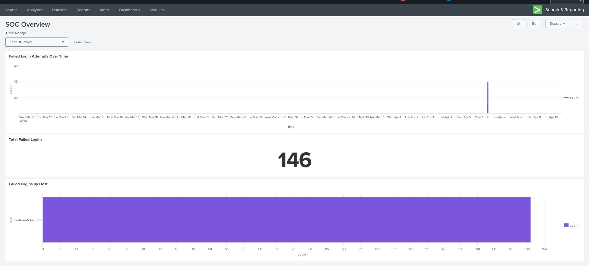

# SOC Home Lab

## Overview
A personal SOC home lab built on Ubuntu 24.04 LTS running in VirtualBox.
Designed to simulate real security operations workflows using Splunk as the SIEM.

## Environment
- Host OS: Windows
- VM: Ubuntu 24.04 LTS (VirtualBox)
- SIEM: Splunk Enterprise 10.2.1
- Log Sources: /var/log/syslog, /var/log/auth.log

## Lab Exercises

### Exercise 1: Failed Authentication Detection
Simulated brute force login attempts against a local user account.
Generated failed authentication events and detected them in Splunk using auth.log.

**Search used:**
source="/var/log/auth.log" "authentication failure" earliest=-5m

**Findings:**
3 failed authentication events detected for user cortrae.
Events included timestamp, username, terminal (tty), and user ID (uid).

### Exercise 2: Sudo Privilege Escalation Monitoring
Monitored sudo usage across the system to detect potential privilege escalation.

**Script:** sudo_monitor.sh

**Findings:**
23 sudo commands detected on the system.
1 failed sudo attempt identified.
Script extracts exact commands run, user responsible, and timestamps.

**Why it matters:**
Privilege escalation is one of the most common post-exploitation techniques.
Monitoring sudo usage is a core SOC analyst task.

### Exercise 3: Login Activity Report
Generated a full summary of successful vs failed login sessions across the system.

**Script:** login_report.sh

**Findings:**
244 successful sessions detected.
7 failed login attempts recorded.
A high failed-to-successful ration would indicate a brute force attack in progress.

**Why it matters:**
Baseline login activity is the foundation of anomaly detection.
SOC analysts establish normal behavior patterns to identify deviations.
Any sudden spike in failed logins triggers investigation.

### Exercise 4: Port Scan Detection
Monitored system logs for indicators of port scanning activity.

**Script:** port_scan_detect.sh

**Findings:**
0 port scan indicators detected.
0 connection refused events in syslog.
Clean baseline established for future comparison.

**Why it matters:**
Port scanning is typically the first phase of a network attack.
Establishing a clean baseline allows analysts to immediately identify
when scanning activity begins.

### Exercise 5: Unified SOC Master Report
Built a master script that runs all detection scripts and outputs a single unified report.

**Script:** soc_report.sh

**What it does:**
Calls all four detection scripts in sequence and presents findings
under a single report header with timestamp and hostname.

**Why it matters:**
In a real SOC environment analysts need consolidated views across
multiple detection categories. This script simulates that workflow
and can be scheduled to run automatically via cron.

### Exercise 6: Automated Reporting with Cron
Scheduled the SOC master report to run automatically every 30 minutes using cron.

**Cron schedule:** */30 * * * *
**Output log:** /home/cortrae/linux_practice/cron_report.log

**What it does:**
Runs soc_report.sh on a schedule and appends output to a log file.
Simulates automated monitoring in a real SOC environment.

**Why it matters:**
SOC environments rely on automated alerting and reporting.
Manual monitoring is not scalable -- automation is the standard.
Understanding cron is fundamental for any Linux-based IT role.

### Exercise 7: Splunk Brute Force Alert
Built a real-time scheduled alert in Splunk that detects brute force SSH attempts.
Simulated attacks using repeated failed SSH logins and confirmed alert firing.

**Search used:**
source="/var/log/auth.log" "Failed password"

**Alert settings:**
- Schedule: Every 5 minutes (cron: */5 * * * *)
- Trigger: Number of results > 3
- Action: Add to Triggered Alerts

**Findings:**
Generated 100+ failed login events via SSH brute force simulation.
Alert fired successfully within one 5 minute cron cycle.

**Why it matters:**
Brute force detection is one of the most fundamental SOC use cases.
This exercise demonstrates end-to-end SIEM alerting from log ingestion
to triggered alert -- the core workflow of a SOC analyst.

### Exercise 8: Splunk SOC Dashboard
Built a visual SOC overview dashboard in Splunk Enterprise with three panels:
- Line chart showing failed login attempts over time (5 minute intervals)
- Single value panel showing total failed login count
- Bar chart showing failed logins by host

**Why it matters:**
SOC analysts rely on dashboards for at-a-glance situational awareness.
Visual data makes it faster to identify spikes, patterns, and anomalies
that raw log searches can miss.

### Exercise 9: System Baseline Capture
Built a bash script that snapshots the normal state of the system for anomaly detection.

**Script:** baseline.sh

**What it captures:**
- Running processes
- Open ports and listening services
- Logged in users
- Disk usage
- Failed login count from auth.log

**Why it matters:**
Establishing a baseline is the foundation of anomaly detection.
SOC analysts and sysadmins document normal system behavior so any
deviation — new open port, unknown process, unusual disk growth —
immediately stands out as a potential indicator of compromise.
